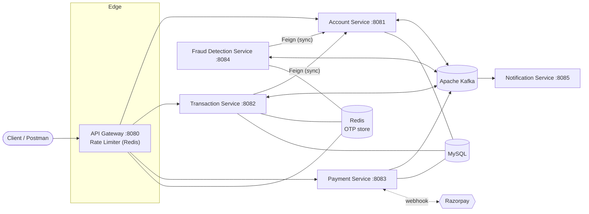
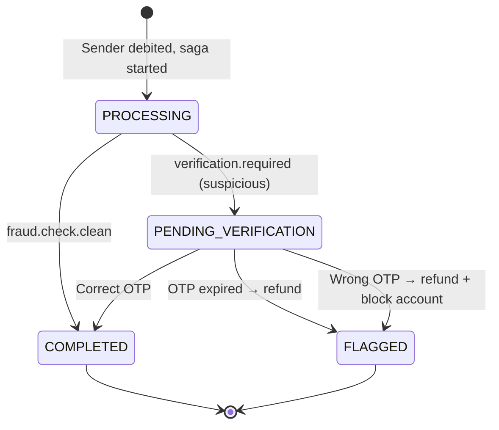
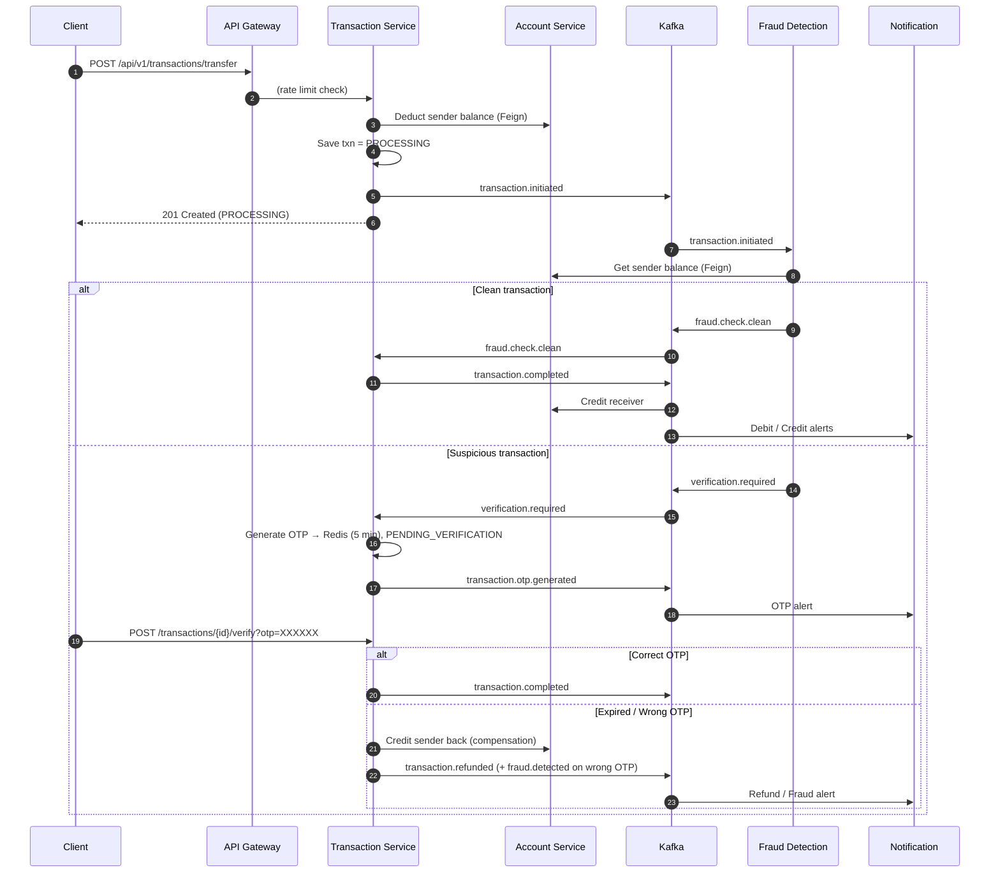
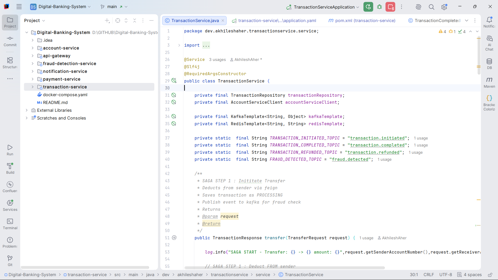

<div align="center">

# 🏦 Digital Banking System

**A microservices-based banking platform with real-time fraud detection, OTP step-up verification, and Saga-based distributed transactions — built on Spring Boot, Kafka and Redis.**


[Overview](#-overview) · [Architecture](#-architecture) · [Saga Pattern](#-saga-pattern) · [Kafka Topics](#-kafka-topics) · [Getting Started](#-getting-started) · [API Reference](#-api-reference) · [Demo](#-screenshots--demo)

</div>

---

## 📌 Overview

Digital Banking System demonstrates how a modern banking backend can **detect fraudulent transactions while staying scalable, reliable, and consistent** across independently deployed services.

Each service owns its own responsibility (and data), and they coordinate through **Apache Kafka** events and **OpenFeign** calls. Because a money transfer spans several services, ACID transactions are not an option — so consistency is maintained with the **Saga pattern**, including **compensating transactions** (automatic refunds) when something goes wrong.

### ✨ Highlights

- 🚪 **API Gateway** — single entry point with **Redis-backed Token Bucket rate limiting** per client IP
- 🔄 **Saga pattern** with compensation — sender is refunded automatically if verification fails or OTP expires
- 🕵️ **Real-time fraud detection** — velocity, unusual amount, and balance-drain checks
- 🔐 **OTP step-up verification** — suspicious transfers are paused and need a 5-minute OTP stored in Redis
- 📨 **Event-driven architecture** — services are decoupled through Kafka topics
- 🔔 **Notification service** — reacts to events to raise debit/credit, OTP, fraud, refund, and payment alerts
- 💳 **Razorpay integration** — order creation and webhook handling for payments
- 🐳 **Docker Compose** for Kafka, Zookeeper, MySQL and Redis

---

## 🏗 Architecture



### Services

| Service | Port | Responsibility | Stores |
|---|---|---|---|
| **api-gateway** | `8080` | Routing, per-IP rate limiting (Token Bucket) | Redis |
| **account-service** | `8081` | Create accounts, balance, block account, debit/credit; consumes `transaction.completed` & `fraud.detected` | MySQL |
| **transaction-service** | `8082` | Transfer orchestration, Saga steps & compensation, OTP generation/verification | MySQL, Redis |
| **payment-service** | `8083` | Razorpay order creation & webhook handling; publishes payment events | MySQL |
| **fraud-detection-service** | `8084` | Consumes every initiated transaction and runs fraud rules | Redis |
| **notification-service** | `8085` | Consumes events and dispatches user alerts | — |

---

## 🧰 Tech Stack

| Layer | Technology |
|---|---|
| **Language** | Java 17 |
| **Framework** | Spring Boot 4.1.1, Spring MVC, Spring Data JPA, Bean Validation |
| **API Gateway** | Spring Cloud Gateway (WebFlux) with `RequestRateLimiter` |
| **Inter-service calls** | Spring Cloud OpenFeign |
| **Messaging** | Apache Kafka (Confluent `cp-kafka:7.4.0`) + Zookeeper, Spring Kafka |
| **Distributed transactions** | **Saga pattern** (with compensating transactions) |
| **Caching / state** | Redis (rate limiting, OTP storage, fraud velocity counters) |
| **Database** | MySQL |
| **Payments** | Razorpay Java SDK `1.4.10` |
| **Notifications** | Kafka consumers (+ Spring Mail starter included) |
| **Build** | Maven (Maven Wrapper included) |
| **Containers** | Docker, Docker Compose |
| **Utilities** | Lombok, Spring Boot Actuator |
| **API testing** | Postman |

---

## 🔄 Saga Pattern

A transfer touches the Account, Fraud Detection, Transaction and Notification services — each with its own responsibility. The **Transaction Service** drives the Saga: it performs local steps, calls the Account Service synchronously through Feign, and advances the flow via Kafka events. If a step fails, a **compensating transaction** refunds the sender.

### Transaction lifecycle



### Saga steps

| Step | Action | Service |
|---|---|---|
| **1** | Deduct amount from the sender (Feign call) and save transaction as `PROCESSING` | Transaction → Account |
| **2** | Publish `transaction.initiated` for fraud analysis | Transaction |
| **3a** | **Clean** → publish `fraud.check.clean` → transaction marked `COMPLETED` | Fraud → Transaction |
| **3b** | **Suspicious** → publish `verification.required` → OTP generated (Redis, 5 min TTL) → status `PENDING_VERIFICATION` | Fraud → Transaction |
| **4** | On completion publish `transaction.completed` → **receiver is credited** | Transaction → Account |
| **Comp.** | OTP expired / wrong → **credit sender back** (Feign), mark `FLAGGED`, publish `transaction.refunded` | Transaction |
| **Comp.** | Wrong OTP additionally publishes `fraud.detected` → **account is blocked** | Transaction → Account |

### End-to-end sequence



---

## 🕵️ Fraud Detection Rules

Every `transaction.initiated` event is evaluated by the Fraud Detection Service. A transaction is flagged as suspicious if **any** rule trips (thresholds are configurable in `fraud-detection-service/src/main/resources/application.yaml`).

| Rule | How it works | Config |
|---|---|---|
| **Velocity check** | Redis counter per account with a 60-second TTL — too many transfers in a minute is flagged | `fraud.max-transactions-per-minute: 5` |
| **Unusual amount** | Compares the amount to the account's running average stored in Redis | `fraud.suspicious-amount-multiplier: 5` |
| **Balance drain** | Flags transfers exceeding a percentage of the sender's balance | `fraud.max-balance-percentage: 0.90` |

---

## 🚦 API Gateway & Rate Limiting

The gateway uses Spring Cloud Gateway's `RequestRateLimiter` filter backed by Redis (**Token Bucket** algorithm), keyed by the client's IP address.

| Route | Path | Replenish rate (req/s) | Burst capacity |
|---|---|---|---|
| Account Service | `/api/v1/accounts/**` | 10 | 20 |
| Transaction Service | `/api/v1/transactions/**` | 10 | 20 |
| Payment Service | `/api/v1/payments/**` | 5 | 10 |

---

## 📡 Kafka Topics

| Topic | Producer | Consumer(s) | Purpose |
|---|---|---|---|
| `transaction.initiated` | Transaction | Fraud Detection | Trigger fraud analysis |
| `fraud.check.clean` | Fraud Detection | Transaction | Transaction passed all checks |
| `verification.required` | Fraud Detection | Transaction | Suspicious — request OTP |
| `transaction.otp.generated` | Transaction | Notification | Deliver OTP to user |
| `transaction.completed` | Transaction | Account, Notification | Credit receiver, send alerts |
| `transaction.refunded` | Transaction | Notification | Saga compensation alert |
| `fraud.detected` | Transaction | Account, Notification | Block account, alert user |
| `payment.completed` | Payment | Notification | Razorpay payment succeeded |
| `payment.failed` | Payment | Notification | Razorpay payment failed |

---

## 📂 Project Structure

```
Digital-Banking-System/
├── api-gateway/               # Spring Cloud Gateway + Redis rate limiter
├── account-service/           # Accounts, balances, block/credit/debit
├── transaction-service/       # Saga orchestration, OTP verification
├── payment-service/           # Razorpay orders & webhooks
├── fraud-detection-service/   # Kafka-driven fraud rules engine
├── notification-service/      # Event-driven alerts
├── screenshot-videos/         # Screenshots, Postman requests & demo videos
├── docker-compose.yaml        # Kafka, Zookeeper, MySQL, Redis
└── README.md
```

---

## 🚀 Getting Started

### Prerequisites

- JDK **17+**
- Docker & Docker Compose
- Postman (optional, for testing)
- Razorpay test keys (only if using the payment service)

### 1. Clone the repository

```bash
git clone https://github.com/AkhileshAher/Digital-Banking-System.git
cd Digital-Banking-System
```

### 2. Start the infrastructure

```bash
docker-compose up -d
```

This starts:

| Container | Image | Host port |
|---|---|---|
| `banking-redis` | `redis:latest` | `6379` |
| `banking-mysql` | `mysql:latest` | `3000` → 3306 |
| `banking-zookeeper` | `confluentinc/cp-zookeeper:7.4.0` | — |
| `banking-kafka` | `confluentinc/cp-kafka:7.4.0` | `9092` |

> The MySQL root password defined in `docker-compose.yaml` is for local development only. Create the databases your services point to (e.g. `account_db`, `transaction_db`, `payment_db`) before first run.

### 3. Configure environment variables

Each service reads its configuration from environment variables:

| Variable | Used by | Example |
|---|---|---|
| `DB_URL` | account, transaction, payment | `jdbc:mysql://localhost:3000/account_db` |
| `DB_USERNAME` / `DB_PASSWORD` | account, transaction, payment | `root` / `<your password>` |
| `KAFKA_BOOTSTRAP_SERVER` | transaction, payment, fraud, notification | `localhost:9092` |
| `KAFKA_BOOTSTRAP_SERVER_URL` | account | `localhost:9092` |
| `KAFKA_CONSUMER_GROUP_ID` | account | `account-service-group` |
| `REDIS_HOST` / `REDIS_PORT` | gateway, transaction, fraud | `localhost` / `6379` |
| `RAZORPAY_KEY_ID` | payment | `rzp_test_xxx` |
| `RAZORPAY_KEY_SECRET` | payment | `xxx` |
| `RAZORPAY_WEBHOOK_SECRET` | payment | `xxx` |

### 4. Run the services

Start each service in its own terminal (any order works, but the Account Service should be up before transfers):

```bash
cd account-service && ./mvnw spring-boot:run
cd transaction-service && ./mvnw spring-boot:run
cd fraud-detection-service && ./mvnw spring-boot:run
cd notification-service && ./mvnw spring-boot:run
cd payment-service && ./mvnw spring-boot:run
cd api-gateway && ./mvnw spring-boot:run
```

All client traffic should go through the gateway at **`http://localhost:8080`**.

---

## 🔌 API Reference

Base URL (via gateway): `http://localhost:8080`

### Account Service

| Method | Endpoint | Description |
|---|---|---|
| `POST` | `/api/v1/accounts` | Create an account |
| `GET` | `/api/v1/accounts/{accountNumber}` | Get account details |
| `GET` | `/api/v1/accounts/{accountNumber}/balance` | Get balance |
| `PUT` | `/api/v1/accounts/{accountNumber}/block` | Block an account |
| `PUT` | `/api/v1/accounts/{accountNumber}/deduct?amount=` | Debit (Saga step 1, internal) |
| `PUT` | `/api/v1/accounts/{accountNumber}/credit?amount=` | Credit / compensate (internal) |

### Transaction Service

| Method | Endpoint | Description |
|---|---|---|
| `POST` | `/api/v1/transactions/transfer` | Initiate a fund transfer (starts the Saga) |
| `POST` | `/api/v1/transactions/{transactionId}/verify?otp=` | Verify OTP for a suspicious transfer |
| `GET` | `/api/v1/transactions/{transactionId}` | Get a transaction |
| `GET` | `/api/v1/transactions/account/{accountNumber}` | Transaction history for an account |

### Payment Service

| Method | Endpoint | Description |
|---|---|---|
| `POST` | `/api/v1/payments/create-order` | Create a Razorpay order |
| `POST` | `/api/v1/payments/webhook` | Razorpay webhook (`payment.captured`, `payment.failed`) |

### Sample requests

<details>
<summary><b>Create account</b> — <code>POST /api/v1/accounts</code></summary>

```json
{
  "accountHolderName": "John Doe",
  "email": "john@example.com",
  "phone": "9876543210",
  "accountType": "SAVINGS",
  "initialDeposit": 50000
}
```
`accountType`: `SAVINGS` · `CURRENT` · `FIXED_DEPOSIT`
</details>

<details>
<summary><b>Transfer funds</b> — <code>POST /api/v1/transactions/transfer</code></summary>

```json
{
  "senderAccountNumber": "001834269851",
  "receiverAccountNumber": "775171908739",
  "amount": 1000,
  "description": "Test Transfer"
}
```

Response `201 Created`:
```json
{
  "id": "5616aac9-fdb8-4181-9856-dcf4dd4f6a91",
  "senderAccountNumber": "001834269851",
  "receiverAccountNumber": "775171908739",
  "amount": 1000,
  "type": "TRANSFER",
  "status": "PROCESSING",
  "description": "Test Transfer"
}
```
</details>

<details>
<summary><b>Verify OTP</b> — <code>POST /api/v1/transactions/{id}/verify?otp=123456</code></summary>

Returns the updated transaction: `COMPLETED` on a correct OTP, or `FLAGGED` (sender refunded) on an expired/incorrect OTP.
</details>

---

## 🖼 Screenshots & Demo

All media lives in [`screenshot-videos/`](./screenshot-videos).

### Postman requests

| Create Account | Fund Transfer | OTP Verification |
|:---:|:---:|:---:|
|  |  |  |

### Infrastructure & services

| Docker services | Project services |
|:---:|:---:|
|  |  |

### Service logs (Saga & Kafka in action)

**Transaction Service**


**Fraud Detection Service**


**Notification Service**


### 🎥 Demo videos

| Video | What it shows |
|---|---|
| [▶ Transaction Service](screenshot-videos/transaction%20service.mp4) | Transfer initiation, Saga steps, OTP flow |
| [▶ Fraud Detection Service](screenshot-videos/fraud%20detection%20service.mp4) | Fraud rules evaluating transactions in real time |
| [▶ Notification Service](screenshot-videos/notification%20service.mp4) | Kafka-driven alerts for debit, credit, OTP, refund |

---

## 🔮 Future Improvements

- [ ] Real email/SMS delivery in the Notification Service (Spring Mail is already a dependency)
- [ ] Authentication & authorization (JWT / OAuth2) at the gateway
- [ ] Outbox pattern + idempotent consumers for exactly-once-style event delivery
- [ ] Dead-letter topics and retry policies for Kafka consumers
- [ ] Service discovery and centralized config
- [ ] Distributed tracing (OpenTelemetry / Zipkin) and centralized logging
- [ ] Containerize all microservices in `docker-compose`
- [ ] Unit and integration tests (Testcontainers for Kafka/MySQL/Redis)
- [ ] CI/CD with GitHub Actions

---

## 👨‍💻 Author

**Akhilesh Aher**

[](https://github.com/AkhileshAher)

---

<div align="center">

⭐ If you found this project useful, consider giving it a star!

</div>
